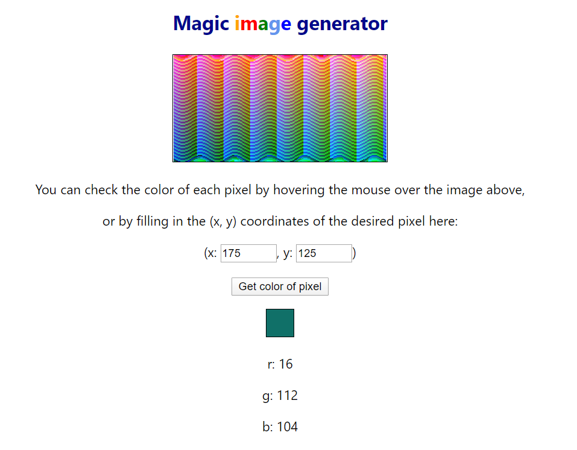

This project was bootstrapped with [Create React App](https://github.com/facebook/create-react-app).

## Introduction

This is an application that generates a 256 x 128 image where each pixel is a discrete color. This is done as a solution to a coding exercise.

## Overview and Instructions

First, after cloning the repo, run yarn install or npm install to install the dependencies.

### `yarn install`

Then, while still in the project directory, you can run:

### `yarn start`

Runs the app in the development mode. 
Open [http://localhost:3000](http://localhost:3000) to view it in the browser.

The page will reload if you make edits. 
You will also see any lint errors in the console.

----------

The image is generated once when the page loads.

You can check from the console some logs of the generation process. The app generates 32768 colors using the Colors.generateColors() function, which then is used in App.generateImage() when mapping the pixels to a sine function.

For debugging, the interface lets you inspect each pixel in the generated image by simply hovering your mouse over the image, or by filling in the x,y coordinates in the form given and then pressing the "Get color of pixel" button.

